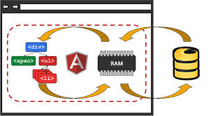

# Firebase & AngularFire
- - -

## Learning Objectives

#### Students Will Be Able To:
- Use AngularFire to simplify working with a Firebase in an AngularJS app.
- Use AngularFire to create a three-way binding between HTML, $scope & a Firebase.

## Roadmap

1. A Quick Look at Some Other Firebase Features
2. Intro to AngularFire
3. Key AngularFire Features
4. Lab: Convert _Big Hippo Depot_ to use Firebase to persist data

## 1. A Quick Look at Some Other Firebase Features

Open the blog Firebase app from earlier in Forge.

#### Briefly Review and Discuss the Functionality Shown in the Toolbar
- Security Rules (declarative security rules)
- Simulator (used to test security rules)
- Analytics (storage & bandwidth usage)
- Login and Auth (configure user authentication)
- Hosting (host your static app on Firebase's servers)
- Secrets (secure JSON Web Token generator)

## 2. Intro to AngularFire

#### What is AngularFire

AngularFire is an officially supported library that makes using Firebase with AngularJS more convenient.

AngularFire provides us with the ability to establish __three-way__ data-binding between the view (HTML), $scope and a firebase as depicted here:



It's __important__ to note that you DO NOT have to use the AngularFire library to use Firebase in an AngularJS application.  You can forego the convenience that AngularFire provides and continue to use the standard Firebase JavaScript library without AngularFire.

#### Steps to Add AngularFire to an AngularJS app

We'll continue to use [CodePen.io](http://codepen.io) and set up a basic AngularJS app.  Feel free to include Bootstrap using CodePen's css settings.

##### Add the AngularJS, Firebase & AngularFire library scripts - in order:

```html
<!-- Angular -->
<script src="https://ajax.googleapis.com/ajax/libs/angularjs/1.3.15/angular.min.js"></script>
<!-- Firebase -->
<script src="https://cdn.firebase.com/js/client/2.2.4/firebase.js"></script>
<!-- AngularFire -->
<script src="https://cdn.firebase.com/libs/angularfire/1.1.1/angularfire.min.js"></script>
```

##### Declare your app's Angular module in the js file and include AngularFire's module as a dependency:

```javascript
// Create our module and inject AngularFire
angular.module('app', ['firebase'])  // no semi-colon since we're going to chain
```
##### Declare a _value_ service named _config_ that can be injected into any controller and/or service.  This is not necessary for a small app, but is considered a best practice.  You can assign any data-type to a value including a function!

```javascript
// Create a basic value service to hold config data
// This data can be injected into other controllers and services
.value('config', {
  firebaseUrl: 'https://scorching-fire-8426.firebaseio.com'
  // add more 'config' properties here...
})
```

##### Create a controller.  We're going to use $scope because AngularFire's three-way binding requires it. We're also injecting our _config_ service:

```javascript
// Create a controller & inject $scope
.controller('MainController', function($scope, config) {
	
	// temporarily put Firebase's URL on $scope to test that our app is bootstraped
	$scope.test = config.firebaseUrl;
	
});
```

##### Bootstrap our Angular app, attach our controller, and test with a simple binding:

```html
<body class="container" ng-app="app" ng-controller="MainController">

	{{test}}
	
</body>
```

##### We still create Firebase ref's to reference a data location like we already learned:

```javascript
.controller('MainController', function($scope, config) {
	var rootRef = new Firebase(config.firebaseUrl);
	
});
```

Now we're ready to learn about AngularFire's features!

## 3. Key AngularFire Features

#### The _$firebaseObject_ Service

The _$firebaseObject_ service returns all of the data located at a ref as an object.  Let's take a look:

```javascript
// Create a synchronized object
$scope.allData = $firebaseObject(rootRef);
```

If data changes on the server, it will automatically be synchronized to the _allData_ variable on our $scope!

Let's see this in action:

```html
<body class="container" ng-app="app" ng-controller="MainController">
  
  <p>{{allData | json}}</p>
  
</body>
```

Now change data in Forge and watch the view update!

Note that with AngularFire, we are not having to use callbacks. However, the data operations are still asynchronous. If we were to ```console.log($scope.allData);```, nothing would show because the data would not have been actually loaded yet.  If you need to execute code upon the initial data being loaded, look into the ```$loaded()``` method.

We can manipulate data and save it to the server as follows:

```html
  <button ng-click="addBlog()">Add Blog</button>
```
```javascript
  $scope.addBlog = function() {
    $scope.allData.blogPosts.push({postBody: "I'm new"});
    $scope.allData.$save(); 
  };
```

**ASK: What is going on here**

It's __important__ to realize that the object returned by _$firebaseObject_ is basically a JS object that's been enhanced with extra methods such as ```$save()```.  Accordingly, in the above example, ```$scope.allData.blogPosts``` represents an array, and the ```push``` method being called on it is just JavaScript's regular ```push``` method.

**PAIR: Lets pair up and code a simple UI and modify the ```addBlog``` function to add a blog post that includes the _allowComments_, _postBody_, _postDate_, and _title_ data fields.**

#### The _$bindTo_ Method

Although its pretty cool how AngularFire's $firebaseObject can automatically keep an object on our $scope in sync with the data on the server, it would be really be awesome if we didn't have to manually call the ```$save()``` method to tell the Firebase server about changes we made locally.  Enter the ```$bindTo()``` method.

Modify our controller to use the ```$bindTo()``` method as so:

```javascript
.controller('MainController', function($scope, $firebaseObject, config) {
  
	var rootRef = new Firebase(config.firebaseUrl);
	
	// Bind the object returned from $firebaseObject to a property named allData 
  	$firebaseObject(rootRef).$bindTo($scope, 'allData');
  
  	$scope.addBlog = function() {
    	// No save() method call required!
    	$scope.allData.blogPosts.push({postBody: "I'm new"});
  	};
  
});
```

#### The _$firebaseArray_ Service

When working with lists of data in which you want Firebase to generate unique ID's for each item, for example, a chat application, the _$firebaseArray_ service is the way to go.

Just like the _$firebaseObject_ service, we will need to inject the _$firebaseArray_ service into our controller:

```javascript
.controller('MainController', function($scope, $firebaseArray, config) {
	// Controller code in here
});
```

Lets say that we want to be able to comment on any blog post.  So far, we don't have any UI to work with, so lets use a couple of ```<input type="radio">``` elements to select which blog to comment on, a ```<textarea>``` to enter the comment in, and button to call a ```addComment()``` method in the controller:

```html
<body class="container" ng-app="app" ng-controller="MainController">
  
    <div class="radio">
        <label><input type="radio" ng-model="selectedBlog" value="0">First Blog</label>
    </div>
    <div class="radio">
      <label><input type="radio" ng-model="selectedBlog" value="1">Second Blog</label>
    </div>
    <div class="form-group">
        <label>Comment: </label>
        <textarea class="form-control" rows="5" ng-model="newComment"></textarea>
    </div>
    <button class="btn btn-success" ng-click="addComment()">+ Add Comment</button>
  
</body>
```

As you can see, we've established a property named _selectedBlog_ to hold the selected blog.  When a user selects a blog, lets call a method named _changeBlog()_ and grab the comments for that blog.  First add a ```ng-change``` on the radios:

```html
<!-- add ng-change to both radio inputs -->
<label><input type="radio" ng-model="selectedBlog" ng-change="changeBlog()" value="0">First Blog</label>
```

Now lets add ```changeBlog()``` to our controller:

```javascript
  $scope.changeBlog = function() {
  		$scope.comments = $firebaseArray(rootRef
           .child('blogPosts')
           .child($scope.selectedBlog)
           .child('comments'));
  });
```

**CFU: Review the ref path**

Lets add the ```addComment()``` method in the controller to add the comment to the blog:

```javascript
.controller('MainController', function($scope, $firebaseArray, config) {
  
	var rootRef = new Firebase(config.firebaseUrl);
  
	$scope.changeBlog = function() {
	  	$scope.comments = $firebaseArray(rootRef
	    	.child('blogPosts')
          .child($scope.selectedBlog)
          .child('comments'));
	 };
	  
	 $scope.addComment = function() {
	 		$scope.comments.$add({
	       	comment: $scope.newComment,
	       	commenter: 'Anyone'
	 		});
  	};
  
});
```

Note that we are using an ```$add()``` method on the synced array.  This method, along with ```$remove()```, are the preferred way to add/remove data from the synced array.

The last method of note is ```$save()``` which can be called on the synced array to save any changes to the data within the array to the server.

Be sure to check the docs for other methods and details.

## 4. Lab - Convert _Big Hippo Depot_ to use Firebase to persist data

Our goal is to add Firebase to our Big Hippo Depot app we created when we introduced AngularJS so that our Hippo data will be persisted.

Key Steps:

- Copy the starter code from the "starter_code_hippo_depot" folder into a new working folder.
- Feel free to create another firebase, or use the same firebase url with a child like this

	```javascript
	var rootRef = new Firebase('https://scorchingfire-8426.firebaseio.com/bighippo');
	```
- Add the Firebase and AngularFire libraries.
- Don't forget to inject the "firebase" module into your main Angular module.
- Since the app uses a list of hippos, lets use the $firebaseArray to create the hippos array on the $scope.
- Have fun!

## Essential Questions

- What JavaScript libraries must be loaded into your web app to use automatic three-way data binding between the view (HTML), $scope and a firebase?

## References

[AngularFire Docs](https://www.firebase.com/docs/web/libraries/angular/)