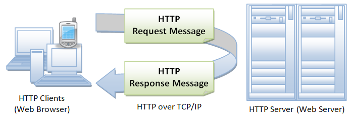

#Intro to HTTP


###You will be able to
* Say what http stands for.
* describe what http requests and responses do.

###What does HTTP stand for?
* HTTP stands for "Hypertext Transfer Protocol". The entire World Wide Web uses this protocol. It was established in the early 1990's. Almost everything you see in your browser is transmitted to your computer over HTTP. For example, when you open a simple article online, your browser probably sends over 40 HTTP requests and received HTTP responses for each.


###About HTTP

* HTTP is an asymmetric request-response client-server protocol as illustrated.  An HTTP client sends a request message to an HTTP server.  The server, in turn, returns a response message.  In other words, HTTP is a pull protocol, the client pulls information from the server (instead of server pushes information down to the client).

* HTTP is a stateless protocol. In other words, the current request does not know what has been done in the previous requests. 
* HTTP permits negotiating of data type and representation, so as to allow systems to be built independently of the data being transferred.
* Quoting from the RFC2616: "The Hypertext Transfer Protocol (HTTP) is an application-level protocol for distributed, collaborative, hypermedia information systems. It is a generic, stateless, protocol which can be used for many tasks beyond its use for hypertext, such as name servers and distributed object management systems, through extension of its request methods, error codes and headers."

###Browser/Requests
When you go to a url in your browser, your browser turns the url into a request message that gets sent to the server, the server interprets that request and responds with what you wanted or an error message if there is an error or that page has moved or something.
  
##URL
A URL is a uniform resource locator, it is built out of 4 parts:  
 
* The protocol, what we're using  
* The Hostname, The DNS domain name (e.g., www.test101.com) or IP address (e.g., 192.128.1.2) of the server.
* The port, The port number that the server is listening on.
* The path and file name, the name and location of the requested resource.

in the url `http://www.example.com/test.html` the protocol is `http`, the hostname is `www.example.com`, the port isnt specified but the standard for HTTP requests is 80, and the path and file name is `test.html`.
So lets try going to example.com and see what we're actually requesting.

###Responses,
So the server can do a few different things when it gets a request
* The server interprets the request received, maps the request into a file under the server's document directory, and returns the file requested to the client.
* The server interprets the request received, maps the request into a program kept in the server, executes the program, and returns the output of the program to the client.
* The request cannot be satisfied, the server returns an error message.


###Anatomy of request and response  
  
* This is what an http request looks like 

* And this is how the server might response 

###HTTP Request Methods

* `GET`, a client can use the Get request to get a web resource from the server
* `POST`, used to post data up to the web server.
* `PUT` ask the server to store data.
* `DELETE`, delete
* HEAD a client can use the head request to get the header that a get request would have obtained. The header contains a line that says when a file was last modified, how could we use this?
* TRACE: Ask the server to return a diagnostic trace of the actions it takes.
* OPTIONS: Ask the server to return the list of request methods it supports.
* CONNECT: Used to tell a proxy to make a connection to another host and simply reply the content, without attempting to parse or cache it. This is often used to make SSL connection through the proxy.

###Get requests and response
Response Status Code
The first line of the response message (i.e., the status line) contains the response status code, which is generated by the server to indicate the outcome of the request.
The status code is a 3-digit number: 
 
* 1xx (Informational): Request received, server is continuing the process.
* 2xx (Success): The request was successfully received, understood, accepted and serviced.
* 3xx (Redirection): Further action must be taken in order to complete the request.
* 4xx (Client Error): The request contains bad syntax or cannot be understood.
* 5xx (Server Error): The server failed to fulfill an apparently valid request.
* Some commonly encountered status codes are:
* 100 Continue: The server received the request and in the process of giving the response.
* 200 OK: The request is fulfilled.
* 301 Move Permanently: The resource requested for has been permanently moved to a new location. The URL of the new location is given in the response header called Location. The client should issue a new request to the new location. Application should update all references to this new location.
* 302 Found & Redirect (or Move Temporarily): Same as 301, but the new location is temporarily in nature. The client should issue a new request, but applications need not update the references.
* 304 Not Modified: In response to the If-Modified-Since conditional GET request, the server notifies that the resource requested has not been modified.
* 400 Bad Request: Server could not interpret or understand the request, probably syntax error in the request message.
* 401 Authentication Required: The requested resource is protected, and require client’s credential (username/password). The client should re-submit the request with his credential (username/password).
* 403 Forbidden: Server refuses to supply the resource, regardless of identity of client.
* 404 Not Found: The requested resource cannot be found in the server.
* 405 Method Not Allowed: The request method used, e.g., POST, PUT, DELETE, is a valid method. However, the server does not allow that method for the resource requested.
* 408 Request Timeout:
* 414 Request URI too Large:
* 500 Internal Server Error: Server is confused, often caused by an error in the server-side program responding to the request.
* 501 Method Not Implemented: The request method used is invalid (could be caused by a typing error, e.g., "GET" misspell as "Get").
* 502 Bad Gateway: Proxy or Gateway indicates that it receives a bad response from the upstream server.
* 503 Service Unavailable: Server cannot response due to overloading or maintenance. The client can try again later.
* 504 Gateway Timeout: Proxy or Gateway indicates that it receives a timeout from an upstream server.

###Putting this all into practice

* Curl, you should all have curl installed, lets test this out with some options to see what get.

try running this
```
$ curl http://www.example.com
```

If we wanted to access a specific port only we would use a `:` just like we do in regular urls.

If we want only the heads we can use the `--head` flag
lets try that.

Curl has millions of options and it can take regular expressions too,
I know one of the first programs I ever wrote was a curl script that downloaded ever single xkcd comic ever to my hard drive. 

Of course it couldnt get the alt text so I was missing half the jokes usually.
[Curl manual](http://curl.haxx.se/docs/manual.html)

###Postman 
Of course Curl is beautiful but I guess to some people its not as beautiful as other things
We're going to use curl at first, then were going to expand and use something called Postman which is a little more visual.
check out this website http://shakeitspeare.com/
how could we use curl and get something from this website?

lets test it out.
How could we find out what the filetype is? 

lets try that.

OK this is kind of a silly api, lets try it with one thats a little more useful, How about IMDB?

Lets check out their page and construct a search request using curl
` $ curl "http://www.omdbapi.com/?t=all%20dogs%20go%20to%20heaven&y&plot=short&r=json"`

So this works, but its kinda hard to read
lets install Postman and try to set up the exact same request.

Try this one too.

`https://query.yahooapis.com/v1/public/yql?q=select%20*%20from%20weather.forecast%20where%20woeid%20in%20(select%20woeid%20from%20geo.places(1)%20where%20text%3D%22hollywood%2C%20ca%22)&format=json&env=store%3A%2F%2Fdatatables.org%2Falltableswithkeys`


###What is an API Key
So it cost money for them to give us data right? They need to figure out whos using what to track data usage then so they dont have crazy overages, websites do this with an API key that is unique to you.


###Resources
[In depth look at options](http://www.ntu.edu.sg/home/ehchua/programming/webprogramming/HTTP_Basics.html)  
[Curl HomePage](http://curl.haxx.se/)
[OMDB](http://www.omdbapi.com/)  
[Postman](http://www.getpostman.com/)
[PCI Compliance](https://www.pcisecuritystandards.org/)
