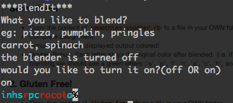

###Smoothies!
- Copy the content of `smoothies_starter.rb` to a file in your OWN folder
- Complete assignment.

---
###Bonus
- Bonus: Make your displayed output colored! Include colors using the `rainbow` gem
- Double-Bonus: Each letter stays its original color after blended.  (i.e. if 'carrots' is colored red, and 'spinach' is colored blue, the resulting output should look like this:

x